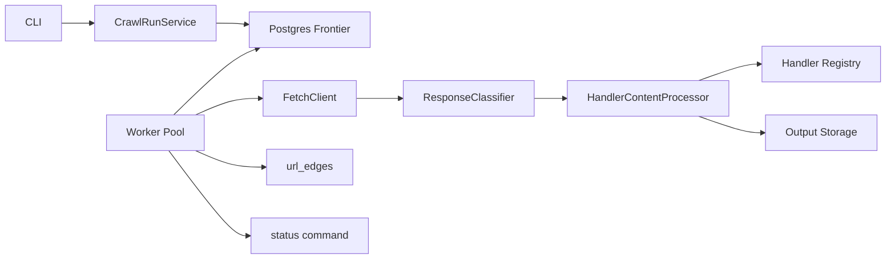

# Production Site Crawler

A production-oriented TypeScript/Node.js CLI crawler backed by PostgreSQL. It accepts a seed URL, keeps crawl state in a durable frontier, fetches every URL through a Fetch API adapter, persists HTML/image/video/PDF bytes under deterministic hash-sharded paths, stores metadata in Postgres, and exposes structured logs plus a `status` command.

For design decisions, schema details, retry/redirect semantics, observability events, and trade-offs, see [docs/ARCHITECTURE.md](docs/ARCHITECTURE.md).

## Quick Start

Prerequisites: Node.js 20+ and Docker.

```sh
npm install
cp .env.example .env
docker compose up -d --wait
npm run migrate:up
```

Mock crawl:

```sh
npm run crawl -- --seed=http://www.example.com/en --mock-fetch --output-dir=/tmp/crawltest
npm run status -- --run-id=<run-id>
```

Real Fetch API crawl (`FETCH_API_BASE_URL` in `.env`):

```sh
npm run crawl -- --seed=https://www.ridelogger.com/en --concurrency=5 --output-dir=output
```

Resume a paused or interrupted run:

```sh
npm run crawl -- --resume=<run-id>
```

Resume loads persisted run config from Postgres. You may override selected limits or `--concurrency`; conflicting `--output-dir` is rejected. SIGINT/SIGTERM pauses the run (`paused`). `--body-strategy` / `FETCH_BODY_STRATEGY` control Fetch API body decoding (`auto` default).

Global install after build/publish:

```sh
npm run build
npm i -g .
production-site-crawler crawl --help
```

## Architecture At A Glance

PostgreSQL is the source of truth. The CLI creates or resumes a run, workers claim frontier rows with row-level locking, `FetchClient` fetches via the external adapter or mock, the response classifier decides retry/permanent/process outcomes, handlers extract metadata and discovered links, and workers record URL outcomes plus discovery edges.



## Checks

```sh
npm run typecheck
npm run lint
npm test
npm run test:coverage
```

CI runs the same checks with a Postgres service container on Node 20 and 22.
