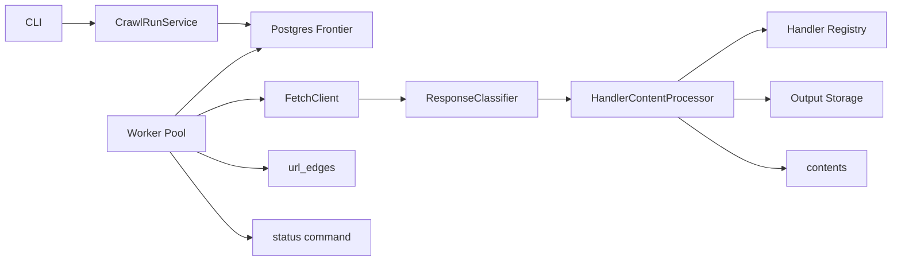

# Production Site Crawler

A production-oriented TypeScript/Node.js CLI crawler backed by PostgreSQL. It accepts a seed URL, keeps crawl state in a durable frontier, fetches every URL through a Fetch API adapter, persists HTML/image/video/PDF bytes under deterministic hash-sharded paths, stores metadata in Postgres, and exposes structured logs plus a `status` command.

This is intentionally a lean crawler, not a full web-scale platform. The implementation focuses on the hard assignment edges: URL normalization and scoping, durable concurrency-safe claiming, retries and rate limiting, content-type driven processing, resumability, and inspectable state.

## How To Run

Prerequisites: Node.js 20+ and Docker.

```sh
npm install
cp .env.example .env
docker compose up -d --wait
npm run migrate:up
```

Local mock crawl:

```sh
npm run crawl -- --seed=http://www.example.com/en --mock-fetch --output-dir=/tmp/crawltest
npm run status -- --run-id=<run-id>
npm run status -- --run-id=<run-id> --json
```

Real Fetch API crawl uses `FETCH_API_BASE_URL` from `.env`; the client calls it with `?url=<target-url>` and expects a JSON envelope containing `statusCode`, `headers`, and `body`:

```sh
npm run crawl -- --seed=https://www.ridelogger.com/en --concurrency=5 --output-dir=output
```

Resume an active run:

```sh
npm run crawl -- --resume=<run-id>
```

Resume loads the original run configuration from Postgres (`concurrency`, limits, scope, and `output_dir`). You may explicitly override `--concurrency`, `--max-urls`, `--max-depth`, `--max-bytes`, or `--max-runtime-seconds`; accepted overrides are persisted before workers start. A conflicting explicit `--output-dir` is rejected because stored content paths are relative to the run's persisted output directory. Graceful SIGINT/SIGTERM pauses the run (`paused`) so it can be resumed later; `max-runtime-seconds` applies per session (a resumed run gets a fresh runtime budget).

Useful checks:

```sh
npm run typecheck
npm run lint
npm test
npm run test:coverage
```

## Architecture

The crawler treats PostgreSQL as the source of truth. The CLI creates or resumes a crawl run, workers claim frontier rows with row-level locking, `FetchClient` fetches via either the external adapter or test mock, the response classifier decides retry/permanent/process outcomes, content handlers extract metadata and discovered links, and the worker records URL outcomes and discovery edges.



Key responsibilities: `CrawlRunService` owns run lifecycle and stale recovery; `FrontierRepository` owns durable queue operations; `WorkerPool` owns concurrency and termination; `FetchClient` isolates the external API contract; handlers own content-specific metadata; `OutputStorage` owns deterministic files; `StatusService` reports DB state.

## Key Decisions

- **D1: Postgres as frontier and store.** `FOR UPDATE SKIP LOCKED` gives safe concurrent claiming, uniqueness gives deduplication, and persisted rows make resume/status/debugging straightforward; Redis/SQS/Kafka would be premature here.
- **D2: Registrable-domain scope by default.** A real site often moves between `www` and apex domains, so registrable-domain scope avoids accidentally crawling almost nothing; exact hostname remains a policy option in code.
- **D3: Content-Type over extension.** Handlers and output suffixes are selected from response `Content-Type`, not URL paths, because real URLs often lie or omit extensions.
- **D4: Fetch success is not metadata success.** If bytes are saved, the URL can be `done`; metadata failures are isolated on `contents.metadata_status` and `metadata_error`.
- **D5: Handler registry extensibility.** Adding a content type means adding a handler and registering it, not changing worker control flow.
- **D6: Termination waits for in-flight work.** Workers do not finish just because no URL is immediately claimable; they also wait for in-progress and future retryable work so HTML parsing can enqueue follow-ups safely.
- **D7: Binary metadata is best effort.** File size is always available; video duration is `null` in the MVP rather than adding native tooling.
- **D8: Body decoding is explicit.** The Fetch API boundary normalizes bodies to `Buffer`; base64 is the default for the real JSON transport, while tests can use buffers directly.
- **No homepage fallback.** A 404 seed is a user-selected URL failing, not permission to crawl another URL silently.

## Data Model

The schema is four tables: `crawl_runs`, `crawl_urls`, `contents`, and `url_edges`. `crawl_urls` is the frontier, outcome log, retry schedule, and dedup source via `(crawl_run_id, normalized_url)`. `contents` stores one row per processed URL with `kind`, `content_type`, `file_path`, byte/hash metadata, and JSONB content metadata. `url_edges` records discovery relationships, including out-of-scope URLs without polluting the frontier. There is no `domains` table because one run has one fixed scope; domain-level state belongs to a larger multi-site crawler.

## Retry, Rate Limiting, And Limits

Retryable failures use exponential backoff with jitter. `429` parses `Retry-After` and also triggers a global pause because the Fetch API is the shared bottleneck. `404` becomes `permanent_failed`, `403` becomes `blocked`, unsupported `Content-Type` becomes `skipped_unsupported`, and null/empty bodies are retried. Safety limits (`max_urls`, `max_depth`, `max_bytes`, `max_runtime_seconds`) stop new claiming while letting in-flight work settle.

## Resumability And Termination

A run can be resumed by ID. The database is the source of truth for run configuration on resume. Graceful stop marks the run `paused`; crash recovery and resume immediately reclaim `in_progress` rows to `queued`. `done` rows are not reprocessed, and retry state remains in Postgres. Finalization is based on durable URL statuses, so a crash leaves enough state to inspect or continue.

## Content Processing

HTML extracts title and links from common sources (`a`, `img`, `video`, `source`, `link`, `object`, `embed`). Images record dimensions via `image-size`; PDFs record page count/title when parsing succeeds; videos record size and a null duration. All content is saved under `output/<kind>/<hash[0:2]>/<hash[2:4]>/<url_hash>.<ext>` using extensions derived from `Content-Type`.

## Trade-offs And Deferred Work

Deliberately deferred: robots.txt, sitemaps, `rel=canonical`, JavaScript rendering, distributed workers, a dedicated queue, Redis-backed distributed rate limiting, object storage, metrics/tracing, a dashboard, and full content-dedup enforcement. Each is valuable at production scale, but none is required to prove the core durable crawler design in this take-home.

## Production Evolution

For production scale, I would move output files to object storage, add per-host politeness and robots/sitemap state, add OpenTelemetry metrics/traces, use a distributed queue only once multiple worker fleets justify it, and make rate limiting shared across processes. I would also add canonical URL policy, richer content parsers, and operational dashboards once the core crawl semantics are stable.

## What I Would Improve With More Time

I would add robots.txt/sitemap support, a small CLI report for failed URLs, stronger redirect handling tests, pluggable video duration extraction, and a production deployment profile. I would also tighten status output for large crawls and add CI wiring around the existing typecheck/lint/test/coverage commands.
