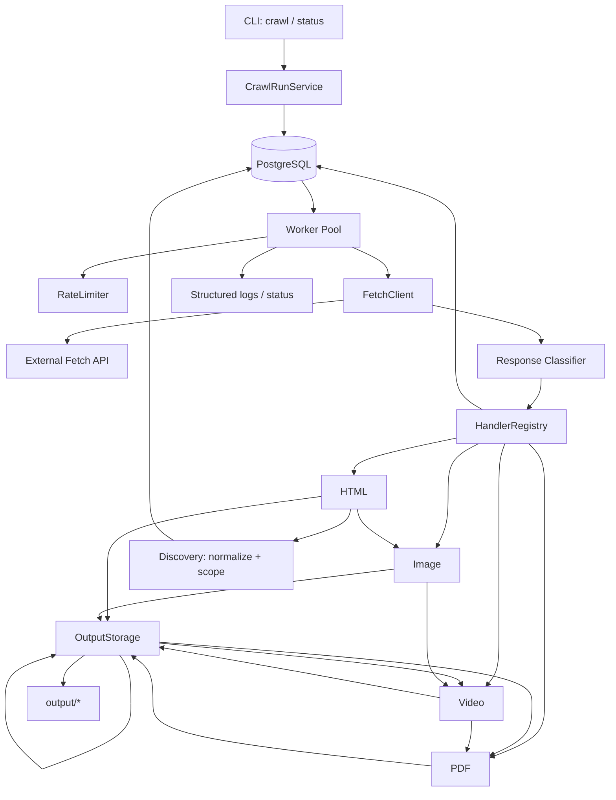

# Architecture & Design

**Stack:** TypeScript / Node.js CLI + PostgreSQL

**Design philosophy:** a lean crawler that still handles the hard cases. Every component earns its place against a concrete requirement; anything not needed for the core is listed as a deliberate production extension rather than built.

---

## 1. What it does

A CLI crawler that takes a seed URL, discovers in-scope links, fetches **all** content through the external Fetch API, persists files by type together with their metadata, and keeps **durable, resumable, concurrency-safe** crawl state in PostgreSQL. It is a small durable task-processing system, not a script.

```bash
npm run crawl -- --seed=http://www.example.com/en --concurrency=5
```

Core loop:

```
seed URL → crawl_run + first queued task
  → worker pool claims tasks (FOR UPDATE SKIP LOCKED)
  → FetchClient calls the Fetch API
  → response classified by status + Content-Type
  → content handler persists file + metadata
  → HTML handler discovers links → normalize → scope check → enqueue (ON CONFLICT DO NOTHING)
  → repeat until frontier drained AND no work in flight
```

---

## 2. Scope: implemented vs. deliberately deferred

### Implemented
- Seed URL intake, scope derivation, durable frontier in Postgres.
- Concurrency-safe claiming; each URL processed at most once.
- Four content types downloaded + processed: HTML, image, video, PDF.
- Metadata per type (title/link count, dimensions/size, size/duration, pages/title).
- Clean separation of permanent vs. transient failures (404/403 vs 429/500/network/null-body).
- Retry with backoff + jitter, `Retry-After` handling, global rate reaction to 429.
- Resumability after crash/interrupt (`recoverAllInProgress` on resume; stale recovery helper exists but is not wired into the active crawl path).
- Safety limits (max URLs/depth/bytes/runtime).
- Structured logs + `status` command + inspectable DB.
- Focused unit + integration tests (mock fetch).

### Deliberately deferred (production extensions)
robots.txt, sitemaps, `rel=canonical` merging, JS rendering, distributed workers, a dedicated queue (Kafka/SQS/RabbitMQ), Redis rate limiter, object storage, metrics/tracing stack, web dashboard, full content-dedup enforcement, a `crawl_events` audit table.

---

## 3. Architecture



| Component | Single responsibility |
|---|---|
| `CrawlRunService` | Create/resume run, derive scope, seed frontier, recover stale tasks, finalize run status. |
| `FrontierRepository` | Durable queue: enqueue, concurrency-safe claim, mark outcome, recover stale, termination checks. |
| `FetchClient` | Adapter over Fetch API. `HttpFetchClient` + `MockFetchClient`. Normalizes `body` to `Buffer`. |
| `ResponseClassifier` | Maps (status, headers, body) → action (process / retry / permanent / blocked / skip). |
| `RetryPolicy` | Retryability + next-attempt time (backoff, jitter, `Retry-After`). |
| `RateLimiter` | Paces requests; global pause/slowdown on 429. |
| `HandlerRegistry` + `ContentHandler`s | Content-type-dispatched processing. Adding a 5th type = add one handler. |
| `UrlNormalizer` / `ScopePolicy` | Canonical URL + in/out-of-scope decision. |
| `OutputStorage` | Deterministic hash-based file paths per type. |

---

## 4. Key design decisions

**D1 — Postgres as both store and frontier.** Row-level locking (`FOR UPDATE SKIP LOCKED`) gives safe concurrent claiming; uniqueness gives dedup; a durable table gives resumability and inspectability. A dedicated queue earns its place only when fetch/processing workers scale horizontally, so no Redis/SQS/Kafka here.

**D2 — Scope = registrable domain by default, configurable.** The task is to stay within the seed's domain. "Domain" is interpreted as the registrable domain (eTLD+1), so `www.example.com` and `example.com` are treated as the same site; subdomains are included. This avoids the failure mode where exact-hostname scoping silently crawls almost nothing because a site links to its apex. Policy is pluggable: `registrable-domain` (default), `exact-hostname`, `subdomain-allowlist`.

**D3 — Content-Type is the source of truth, never the URL extension.** The extension only informs the output file suffix *after* the type is decided from `Content-Type`. A missing/unsupported type becomes `skipped_unsupported` — recorded, not crashed.

**D4 — Fetch success ≠ metadata success.** If bytes are fetched and persisted, the URL is `done` even if metadata extraction (e.g. a PDF parse) fails; the failure is recorded on the content row (`metadata_status`, `metadata_error`). This models real crawlers correctly.

**D5 — Extensibility via handler registry.** The crawler core never branches on content type; it asks the registry for a handler. Adding a type means implementing a handler, registering it, and mapping an extension — no core changes.

**D6 — Termination waits for in-flight work.** A worker stops only when there is no claimable task, no retry due in the future, **and no task is `in_progress`**. This closes the race where a worker exits while another is still parsing HTML that will enqueue new URLs.

**D7 — Best-effort binary/duration.** `body` is normalized to `Buffer` regardless of transport encoding (string/base64/Buffer) — see D8. Video duration is best-effort (`null` allowed); file size is always stored.

**D8 — Robust, configurable `body` decoding.** `FetchClient` normalizes every Fetch API body to `Buffer | null` with `auto` as the default strategy. In `auto`, textual `Content-Type`s (`text/*`, JSON, XML, XHTML, JavaScript) decode strings as UTF-8; otherwise strings that strictly look like base64 are decoded as base64; otherwise strings fall back to UTF-8. The strategy can be overridden with `FETCH_BODY_STRATEGY` or `--body-strategy` (`auto | base64 | utf8`). Residual ambiguity is explicit: a string that accidentally is valid base64 with a binary or missing `Content-Type` is decoded as base64, but the override exists for that case.

**No homepage fallback.** A 404 on the seed is a user-selected URL failing, not permission to silently crawl a different URL.

---

## 5. Data model (4 tables)

Design goal: reflect the problem without column bloat. A `crawl_events` audit table is intentionally omitted (structured logs cover audit).

### `crawl_runs`
```sql
CREATE TABLE crawl_runs (
  id                  UUID PRIMARY KEY DEFAULT gen_random_uuid(),
  seed_url            TEXT NOT NULL,
  normalized_seed_url TEXT NOT NULL,
  scope_host          TEXT NOT NULL,               -- registrable domain (or host, per policy)
  scope_policy        TEXT NOT NULL DEFAULT 'registrable_domain',
  status              TEXT NOT NULL DEFAULT 'running',
  max_urls            INTEGER,
  max_depth           INTEGER,
  max_bytes           BIGINT,
  max_runtime_seconds INTEGER,
  concurrency         INTEGER NOT NULL DEFAULT 5,
  output_dir          TEXT NOT NULL DEFAULT 'output',
  total_bytes         BIGINT NOT NULL DEFAULT 0,
  urls_enqueued       INTEGER NOT NULL DEFAULT 0,   -- admitted in-scope frontier rows
  started_at          TIMESTAMPTZ NOT NULL DEFAULT now(),
  finished_at         TIMESTAMPTZ,
  updated_at          TIMESTAMPTZ NOT NULL DEFAULT now()
);
```
Run statuses: `running`, `paused`, `completed`, `completed_with_failures`, `limit_reached`, `failed`, `cancelled`.

### `crawl_urls` (the frontier + per-URL state)
```sql
CREATE TABLE crawl_urls (
  id                     UUID PRIMARY KEY DEFAULT gen_random_uuid(),
  crawl_run_id           UUID NOT NULL REFERENCES crawl_runs(id) ON DELETE CASCADE,
  url                    TEXT NOT NULL,
  normalized_url         TEXT NOT NULL,
  url_hash               TEXT NOT NULL,             -- for file naming
  host                   TEXT NOT NULL,
  depth                  INTEGER NOT NULL DEFAULT 0,
  status                 TEXT NOT NULL DEFAULT 'queued',
  http_status_code       INTEGER,
  content_type           TEXT,
  attempt_count          INTEGER NOT NULL DEFAULT 0,
  max_attempts           INTEGER NOT NULL DEFAULT 5,
  next_attempt_at        TIMESTAMPTZ NOT NULL DEFAULT now(),
  last_error             TEXT,
  last_error_type        TEXT,
  discovered_from_url_id UUID REFERENCES crawl_urls(id),  -- cheap discovery tree
  redirect_count         INTEGER NOT NULL DEFAULT 0,
  claimed_at             TIMESTAMPTZ,
  finished_at            TIMESTAMPTZ,
  created_at             TIMESTAMPTZ NOT NULL DEFAULT now(),
  updated_at             TIMESTAMPTZ NOT NULL DEFAULT now()
);

CREATE UNIQUE INDEX crawl_urls_dedup
  ON crawl_urls (crawl_run_id, normalized_url);
CREATE INDEX crawl_urls_claim
  ON crawl_urls (crawl_run_id, status, next_attempt_at, created_at);
```
URL statuses: `queued`, `in_progress`, `done`, `retryable_failed`, `permanent_failed`, `blocked`, `skipped_unsupported`, `redirected`. Out-of-scope URLs are not stored here — they are recorded only as edges (below).

### `contents`
```sql
CREATE TABLE contents (
  id              UUID PRIMARY KEY DEFAULT gen_random_uuid(),
  crawl_url_id    UUID NOT NULL UNIQUE REFERENCES crawl_urls(id) ON DELETE CASCADE,
  crawl_run_id    UUID NOT NULL REFERENCES crawl_runs(id) ON DELETE CASCADE,
  kind            TEXT NOT NULL,                    -- html | image | video | pdf
  content_type    TEXT NOT NULL,
  file_path       TEXT NOT NULL,
  byte_size       BIGINT NOT NULL,
  content_hash    TEXT NOT NULL,                    -- sha256 of bytes: change detection + dedup signal
  etag            TEXT,
  metadata        JSONB NOT NULL DEFAULT '{}',
  metadata_status TEXT NOT NULL DEFAULT 'ok',       -- ok | partial | failed
  metadata_error  TEXT,
  created_at      TIMESTAMPTZ NOT NULL DEFAULT now()
);
CREATE INDEX contents_hash ON contents (content_hash);
```
`metadata` is JSONB so a 5th type needs no schema change. `content_hash` is stored for change detection; the implementation does **not** enforce cross-URL file dedup (documented trade-off).

### `url_edges` (discovery graph)
```sql
CREATE TABLE url_edges (
  id                        UUID PRIMARY KEY DEFAULT gen_random_uuid(),
  crawl_run_id              UUID NOT NULL REFERENCES crawl_runs(id) ON DELETE CASCADE,
  from_url_id               UUID NOT NULL REFERENCES crawl_urls(id) ON DELETE CASCADE,
  to_url_id                 UUID REFERENCES crawl_urls(id) ON DELETE CASCADE,  -- null when not enqueued
  discovered_url            TEXT NOT NULL,
  normalized_discovered_url TEXT NOT NULL,
  in_scope                  BOOLEAN NOT NULL,       -- scope policy only (not depth/limit)
  skip_reason               TEXT,                   -- null = enqueued; scope | depth | limit
  source                    TEXT NOT NULL,          -- a.href | img.src | redirect | ...
  created_at                TIMESTAMPTZ NOT NULL DEFAULT now(),
  CONSTRAINT url_edges_skip_reason_check CHECK (
    skip_reason IS NULL OR skip_reason IN ('scope', 'depth', 'limit')
  )
);
CREATE UNIQUE INDEX url_edges_dedup
  ON url_edges (crawl_run_id, from_url_id, normalized_discovered_url, source);
CREATE INDEX url_edges_from ON url_edges (from_url_id);
```
Records discovery relationships and lets out-of-scope or skipped links be captured without polluting `crawl_urls`. `in_scope` reflects ScopePolicy only; `skip_reason` explains why no frontier row was admitted (`scope`, `depth`, `limit`; `NULL` means enqueued). Edge writes are idempotent via upsert on the unique key above.

No `domains` table: one seed → one fixed scope per run, so the host lives as an attribute. A `domains` entity would earn its place only for multi-domain crawling, per-domain politeness, and robots.txt state.

---

## 6. Concurrency & the frontier

Claim + mark in a single transaction:
```sql
-- claim
SELECT * FROM crawl_urls
WHERE crawl_run_id = $1
  AND status IN ('queued', 'retryable_failed')
  AND next_attempt_at <= now()
ORDER BY created_at
LIMIT 1
FOR UPDATE SKIP LOCKED;
-- then, same tx:
UPDATE crawl_urls
SET status = 'in_progress', claimed_at = now(), updated_at = now()
WHERE id = $claimed;
```
Enqueue is idempotent:
```sql
INSERT INTO crawl_urls (crawl_run_id, url, normalized_url, url_hash, host, depth, status, discovered_from_url_id)
VALUES ($1,$2,$3,$4,$5,$6,'queued',$7)
ON CONFLICT (crawl_run_id, normalized_url) DO NOTHING
RETURNING id;
```
The unique index makes "process at most once" a database guarantee, safe under crashes, concurrency, and resume. Discovery graph writes use the same idempotency pattern: `url_edges` upserts on `(crawl_run_id, from_url_id, normalized_discovered_url, source)`.

---

## 7. Fetch handling

### Status → action
| Status | Action | Terminal status |
|---|---|---|
| 200 + supported body | process | `done` |
| 200 + null/empty body | retry (unreliable API) | `retryable_failed` |
| 200 + unsupported Content-Type | record, skip | `skipped_unsupported` |
| 404 | no retry | `permanent_failed` |
| 403 | no retry (default) | `blocked` |
| 429 | respect `Retry-After`, global pause, retry **without consuming URL attempt budget** | `retryable_failed` |
| 500 / network error | backoff retry | `retryable_failed` |
| 301/302/303/307/308 + `Location` | resolve, scope-check, enqueue in-scope target at same depth, record edge | source `redirected`; target `queued`/`done` |
| 301/302/303/307/308 to same dedup key | update the same row's fetch URL, increment `redirect_count`, requeue | eventual `done` or `permanent_failed` at redirect limit |
| 301/302/303/307/308 without valid `Location` | no retry | `permanent_failed` (`redirect_missing_location` / `redirect_invalid_location`) |

### Headers (case-insensitive)
`Content-Type` → handler; `Content-Length` → sanity-check vs body length; `Retry-After` → 429 scheduling (parses both delta-seconds and HTTP-date); `ETag` → stored for future conditional fetch; `Location` → relevant only if a 3xx appears (see below).

### Redirects
When the Fetch API returns 301, 302, 303, 307, or 308 with a `Location` header, the worker resolves the target relative to the fetched URL, normalizes it, and scope-checks it. In-scope targets are enqueued at the **same crawl depth** as the source URL with an incremented `redirect_count`; out-of-scope targets are recorded only as `url_edges` with `source: redirect`. The source URL becomes `redirected` (not retried). If the target normalizes to the source row's own dedup key (typical trailing-slash or `http` → `https` redirect), the worker does **not** mark the row `redirected`; it updates the same row's fetch `url`, increments `redirect_count`, clears the claim, and requeues it so the canonical target is fetched. Self-redirects do not record `url_edges` because there is no distinct graph edge. Missing or invalid `Location` becomes `permanent_failed`. Redirect chains are bounded by `MAX_REDIRECTS` (10); exceeding the limit becomes `permanent_failed` with `redirect_limit_exceeded`. Duplicate targets rely on the existing unique index on `(crawl_run_id, normalized_url)`.

If the external Fetch API follows redirects internally and only returns final 200 envelopes, this path is dormant in production but remains covered by mock/integration tests.

---

## 8. Retry & rate limiting

`max_attempts` means **total fetch attempts** (including the first), not "retries after the first". `attempt_count` tracks budget-consuming failed fetches only. Server errors, network/timeout failures, empty bodies, and unexpected statuses consume the budget; **429 does not** (shared API throttling, not a URL property). Stale recovery does not consume an attempt.

```ts
const retry = { maxAttempts: 5, baseDelayMs: 5_000, maxDelayMs: 300_000, jitterRatio: 0.25 };
// Budget-consuming: delay = min(base * 2^attemptCount, max) with ±jitterRatio
// 429: Retry-After header or 5s fallback (no exponential backoff on attempt_count)
```
RateLimiter: fixed concurrency + a small inter-request delay. On 429 it reads `Retry-After` and **globally pauses** all workers until it elapses, then resumes, because the Fetch API is the shared bottleneck. Token buckets / per-domain / distributed limiting are production extensions.

---

## 9. Content handlers

```ts
interface ContentHandler {
  readonly kind: 'html' | 'image' | 'video' | 'pdf';
  supports(contentType: string): boolean;
  process(input: ProcessInput): Promise<ProcessResult>; // file + metadata (+ links for HTML)
}
```
The registry finds the first handler whose `supports()` matches the normalized `Content-Type`.

| Handler | Persist | Metadata | Notes |
|---|---|---|---|
| HTML (`cheerio`) | raw HTML | `{ title, discoveredLinkCount }` | count = all discovered links; in/out-of-scope split lives in `url_edges`. |
| Image (`image-size`) | bytes | `{ width, height, fileSize }` | dims fail → save + `partial`. |
| Video | bytes | `{ fileSize, durationSeconds: null }` | duration is not extracted in MVP; metadata stays `partial` with an explicit error message. |
| PDF (`pdf-parse`) | bytes | `{ pageCount, title? }` | parse fail → save + `failed`, URL still `done`. |

HTML link sources: `a[href]`, `img[src]`, `img[srcset]`, `video[src]`, `video[poster]`, `source[src]`, `source[srcset]`, `link[href]` (allowlisted `rel` only), `object[data]`, `embed[src]`, `iframe[src]`. Allowed `<link rel>` values: `stylesheet`, `icon`, `shortcut icon`, `apple-touch-icon`, `manifest`, `preload`, `modulepreload`. Connection hints such as `preconnect` and `dns-prefetch` are ignored. Only `http`/`https` schemes are followed.

---

## 10. URL normalization & scope

Normalizer (deterministic dedup key):
1. Resolve relative against the page URL (WHATWG `URL`); the resolved absolute URL is stored as `url` (the fetch target).
2. Lowercase scheme + host; drop default ports (`:80`/`:443`).
3. Drop fragment.
4. Trailing-slash policy: collapse empty path to `/`; strip trailing slash on non-root paths (`/en/` → `/en`).
5. Scheme policy: canonicalize to `https` in the dedup key so `http`/`https` of the same resource collapse to one task. Only the key is affected; the original scheme is still fetched.
6. Keep query string; sort query params for stable dedup (preserving duplicates).

| Input | Normalized (dedup key) |
|---|---|
| `HTTP://WWW.EXAMPLE.COM:80/a#top` | `https://www.example.com/a` |
| `/about` on `https://example.com/products` | `https://example.com/about` |
| `https://example.com` | `https://example.com/` |
| `https://example.com/en/` | `https://example.com/en` |
| `https://example.com/p?b=2&a=1` | `https://example.com/p?a=1&b=2` |

ScopePolicy (default `registrable_domain`): allowed iff the candidate's registrable domain (via `tldts`) equals the run's. Unsupported schemes (`mailto`, `tel`, `javascript`, `data`, `ftp`, `file`) are rejected. Out-of-scope links are recorded as `url_edges` with `in_scope=false`, `skip_reason='scope'`, and never enqueued.

**Normalization trade-offs:** the dedup key forces `https` and strips trailing slashes on non-root paths. That can collapse `http`/`https` variants and paths such as `/en/` and `/en` into one frontier row even when a site treats them differently. The resolved fetch URL is still stored separately on `crawl_urls.url`, but dedup semantics follow the canonical key. Changing this later requires a migration because it affects unique indexes and historical rows. `subdomain_allowlist` scope remains deferred in code.

---

## 11. Output storage

```
output/<kind>/<hash[0:2]>/<hash[2:4]>/<url_hash>.<ext>
# e.g. output/html/ab/cd/abcd….html   output/images/12/34/1234….png
```
Hash-based names are filesystem-safe, collision-free, stable per normalized URL, and query-string-proof. The extension is derived from `Content-Type`, not the URL. Traceability is preserved via the DB (`crawl_urls.url` ↔ `contents.file_path`).

---

## 12. Resumability & termination

**Resume:** the DB is the source of truth for run configuration (`concurrency`, limits, `scope_policy`, `output_dir`). On resume, persisted values are used unless the CLI explicitly overrides selected limits or concurrency; conflicting `--output-dir` values are rejected because `contents.file_path` is relative to the persisted output root.

Resumable run statuses are `running` and `paused`. `limit_reached` is resumable only when the caller provides an explicit increased limit override. Resume sets status back to `running`, clears `finished_at`, and immediately reclaims all `in_progress` rows for that run to `queued`. A stale `in_progress` recovery helper exists for future crash-recovery wiring, but the active resume/crawl path uses immediate full reclaim via `recoverAllInProgress`. `done` URLs are never reprocessed.

**Graceful stop:** SIGINT/SIGTERM request shutdown, workers finish in-flight work, and the run is finalized as `paused` (explicitly resumable). `cancelled` remains a terminal status for future explicit cancel/admin flows.

**Termination (D6):** a worker exits only when all hold: `claimNextUrl` returns null, no `retryable_failed` has a future `next_attempt_at`, and no rows are `in_progress`. Otherwise it sleeps briefly and re-polls. The run is finalized `completed` / `completed_with_failures` / `limit_reached` / `paused`.

---

## 13. Safety limits

`max_urls`, `max_depth`, `max_bytes`, `max_runtime_seconds`.

| Limit | Semantics | Enforcement |
|---|---|---|
| `max_urls` | Max in-scope URLs **admitted** to the frontier (incl. seed) | Transactional counter `urls_enqueued` at enqueue time (strict, 0 overshoot) |
| `max_depth` | Max discovery depth; `0` = seed only | Pre-enqueue check; `null`/`unlimited` = no depth cap |
| `max_bytes` | Max persisted bytes | Best-effort in-memory check before claim |
| `max_runtime_seconds` | Per-session runtime budget | Timer before claim |

`null` (or CLI `unlimited`/`none`) means no limit for URLs/bytes/runtime. Only `max_depth=0` treats zero as a meaningful constraint; other limits reject `0`. URL/depth/byte limits are cumulative across pause/resume via persisted DB state. `max_runtime_seconds` is **per-session**: each worker-pool session starts a fresh timer. On breach: stop claiming, let in-flight work finish, mark `limit_reached`, leave queued URLs in the DB (resumable with an explicit increased limit override).

---

## 13a. Worker resilience

Task-level isolation wraps the full post-claim lifecycle; processing errors classify as retryable (default) or permanent and always attempt a URL outcome via bounded outcome-mark retries. The worker pool uses `Promise.allSettled` so one worker exit does not fail-fast siblings. Core-loop DB operations retry with exponential backoff (5 consecutive failures → worker exit). `finalizeRun` always runs in a `finally` block; infra failure finalizes as `failed`. `concurrency` must be ≥ 1.

---

## 14. Observability

Structured `pino` logs with stable event names:

`run_started`, `run_resumed`, `run_completed`, `run_failed`, `crawl_summary`, `crawl_failed`, `url_claimed`, `fetch_succeeded`, `fetch_failed`, `content_saved`, `content_length_mismatch`, `links_discovered`, `url_skipped_unsupported`, `url_blocked`, `url_permanent_failed`, `redirect_followed`, `redirect_rejected`, `enqueue_skipped_limit`, `url_limit_reached`, `limit_reached`, `rate_limited`, `rate_limit_retry_scheduled`, `rate_limited_pause`, `retry_scheduled`, `task_processing_failed`, `task_outcome_mark_failed`, `worker_infra_failure`, `worker_crashed`, `shutdown_requested`, `status_requested`, `status_run_not_found`, `db_pool_error`.

`content_saved` is emitted after bytes are persisted and a `contents` row is written. `content_length_mismatch` is a warning-only sanity check when `Content-Length` disagrees with the decoded body size; it does not fail the crawl.

Plus a `status` command:
```bash
npm run status -- --run-id=<uuid>
# prints per-status URL counts, per-kind content counts, bytes downloaded
```
No dashboard (production extension).

---

## 15. Testing

**Unit:** URL normalizer (fragment, ports, trailing slash, scheme, query sort, relative resolve); scope policy (same registrable domain, subdomain per policy, rejected schemes); retry policy (404/403 no-retry, 429 Retry-After, 500 backoff, max attempts, jitter bounds); content-type classifier; file-path strategy; HTML link extraction + count.

**Integration (MockFetchClient):**
1. Simple crawl (HTML → HTML + image), no duplicates.
2. Same URL discovered from two pages → one `crawl_urls` row, one content, two edges.
3. 404 → `permanent_failed`, no retry.
4. 500,500,200 → `attempt_count=3`, `done`.
5. 429 + Retry-After → retryable, `next_attempt_at ≈ now+delay`, limiter paused.
6. Resume: stale or fresh `in_progress` reset, `done` untouched, `queued` processed; paused runs resume with persisted config.
7. Concurrency: many workers + same URL from many pages → unique constraint holds, one content row.

---

## 16. Tech stack & dependencies

| Purpose | Package | Why |
|---|---|---|
| CLI | `commander` | tiny, clear. |
| DB | `pg` + hand-written SQL | SQL clarity; no ORM over the frontier queries. |
| Migrations | `node-pg-migrate` | simple. |
| Logging | `pino`, `pino-pretty` (dev) | structured, fast. |
| Config | `dotenv` | local `.env` loading for CLI/migrations. |
| HTML | `cheerio` | lightweight, reliable. |
| Image meta | `image-size` | light, no native build. |
| PDF meta | `pdf-parse` | pages + title. |
| Video meta | none (MVP) | bytes saved; duration stays `null`. |
| Scope | `tldts` | registrable-domain computation (PSL). |
| Tests | `vitest`, `@vitest/coverage-v8` | fast unit/integration coverage. |
| Build/dev | `typescript`, `tsx` | compile + local TS CLI execution. |
| Lint/format | `eslint`, `prettier`, `typescript-eslint` | repo hygiene. |
| Hash | node `crypto` | built in. |

Minimal-dependency rule: every non-trivial dependency is justified; nothing heavy unless a requirement demands it.

---

## 17. Repository structure

```
src/
  cli/            crawl.ts, status.ts, index.ts
  run/            CrawlRunService.ts, RunRepository.ts
  frontier/       FrontierRepository.ts
  fetch/          FetchClient (types), HttpFetchClient.ts, MockFetchClient.ts
  worker/         WorkerPool.ts, worker.ts, edgeTarget.ts, RetryPolicy.ts, RateLimiter.ts,
                  ResponseClassifier.ts, ContentProcessor.ts, SafetyLimits.ts,
                  classifyProcessingError.ts, outcomeMarkRetry.ts
  content/        HandlerRegistry.ts, ContentHandler.ts, HtmlHandler.ts,
                  ImageHandler.ts, VideoHandler.ts, PdfHandler.ts,
                  HandlerContentProcessor.ts, ContentRepository.ts, EdgeRepository.ts
  url/            UrlNormalizer.ts, ScopePolicy.ts, urlHash.ts
  storage/        OutputStorage.ts, FilePathStrategy.ts
  status/         StatusService.ts, formatStatus.ts
  db/             pool.ts
  log/            logger.ts
migrations/       node-pg-migrate SQL migrations
tests/            unit/, integration/
output/           html/ images/ videos/ pdfs/
docker-compose.yml  package.json  README.md  .env.example
```
Modular, not over-abstracted. Interfaces are introduced only where there is a real second implementation or registry need (e.g. `FetchClient`, `ContentHandler`, the worker seams).

---

## 18. Anti-patterns explicitly avoided

- Over-engineering (Kafka/Redis/k8s/browser rendering) without justification.
- In-memory `Set`/array frontier (breaks resume + concurrency).
- Trusting the URL extension over `Content-Type`.
- Spawning a new "crawler" per link instead of enqueuing tasks.
- Silent homepage fallback when the seed 404s (changes user intent).
- Treating metadata failure as fetch failure.
- Exiting workers while HTML parsing is still in flight (termination race).
- Fail-fast worker pools that abandon siblings on one uncaught error.
- Unhandled post-fetch exceptions leaving tasks stuck `in_progress`.
- Zero-concurrency runs that finalize while queued work remains.
